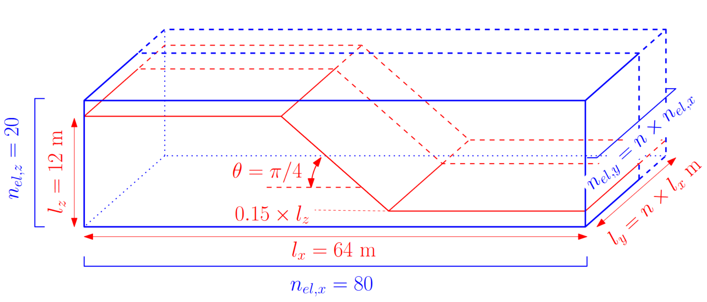
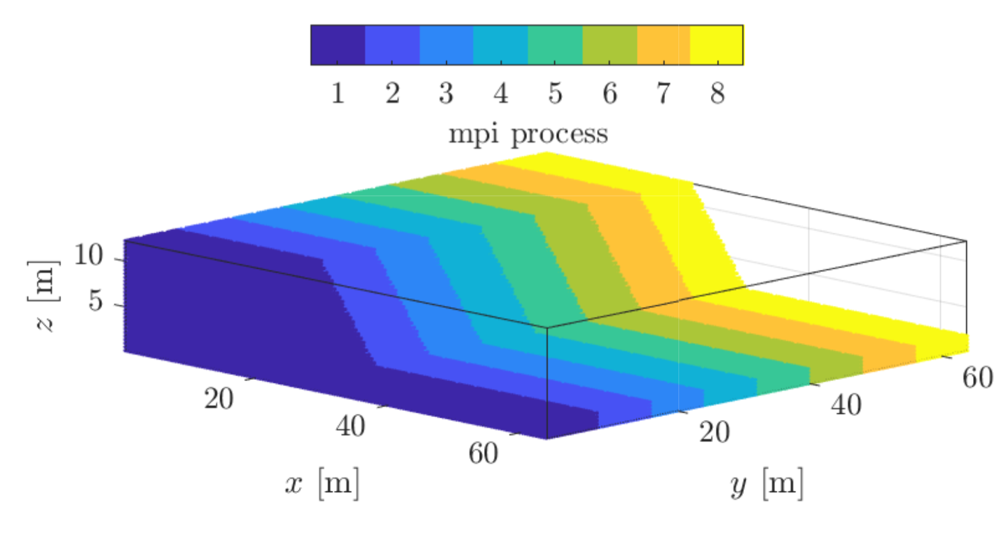
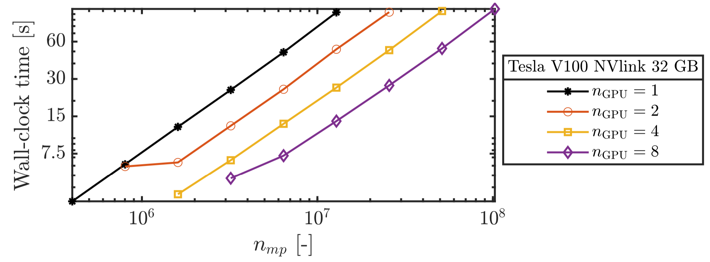

# MPI-MaterialPointSolver: CASE 1

This is the first MPI case implemented by MaterialPointSolver.jl, so we only focus on how to use MPI on Octopus, and try to use some technics from NVIDIA and papers.

This case is from Manu's dissertation: Message passing interface and multi-GPU computing. There are some limitations in this case, i.e., 
- 1D GPU topology
- no computation/communication overlaps
- only mesh-related quantities are shared amongst GPUs, i.e., the material points are not transferred between GPUs during a simulation
- non-adaptative time step
- FP32 is used in this case

## Model Setup

> Figure 1. Geometry for the earth slump. For the multi-GPU implementation, the number of element along the y−direction can be largely increased, i.e., n = 2048.

> Figure 2. Domain partition of the material points amongst 8 GPUs. Combined with an overlap of 8 elements along the y-direction, material points can moderately move while still residing within the same GPU during the whole simulation.

## Hardware

We only want to test this case on 8 Tesla V100.

## Results from ep2-3De v1.0

> Figure 3. Wall-clock time for 1, 2, 4 and 8 Tesla V100 GPUs. (Wall-clock time of ≈ 110 s for nmp ≈ 108.)

## Results from MaterialPointSolver

todo