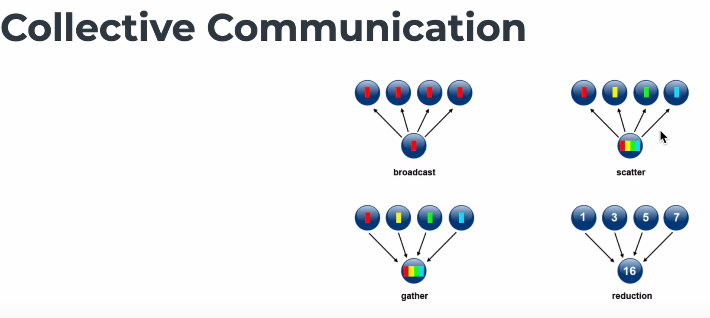

1. adaptive time step: do reduce(min, mp.cfl) first on each process, and then use MPI.Reduce
   to get the minimum cfl value.
2. V100 topology: `nvidia-smi topo -m`
3. V100 NVLink status: `nvidia-smi nvlink --status`

```txt
        GPU0    GPU1    GPU2    GPU3    GPU4    GPU5    GPU6    GPU7    NIC0    CPU Affinity    NUMA Affinity   GPU NUMA ID
GPU0     X      NV1     NV1     NV2     NV2     SYS     SYS     SYS     SYS     0-3,8-11        0               N/A
GPU1    NV1      X      NV2     NV1     SYS     NV2     SYS     SYS     SYS     0-3,8-11        0               N/A
GPU2    NV1     NV2      X      NV2     SYS     SYS     NV1     SYS     SYS     0-3,8-11        0               N/A
GPU3    NV2     NV1     NV2      X      SYS     SYS     SYS     NV1     SYS     0-3,8-11        0               N/A
GPU4    NV2     SYS     SYS     SYS      X      NV1     NV1     NV2     PIX     4-7,12-15       1               N/A
GPU5    SYS     NV2     SYS     SYS     NV1      X      NV2     NV1     PIX     4-7,12-15       1               N/A
GPU6    SYS     SYS     NV1     SYS     NV1     NV2      X      NV2     SYS     4-7,12-15       1               N/A
GPU7    SYS     SYS     SYS     NV1     NV2     NV1     NV2      X      SYS     4-7,12-15       1               N/A
NIC0    SYS     SYS     SYS     SYS     PIX     PIX     SYS     SYS      X
```

SYS (System Interconnect): 这代表连接涉及PCIe总线以及连接NUMA节点间的系统互连。这可能包括多个芯片组和总线，这是最一般的连接方式，通常也是速度最慢的。

NODE (Node Interconnect): 这指的是连接跨越PCIe以及NUMA节点内部的互连。这意味着数据传输在同一个NUMA节点内部进行，可能会比SYS快一些，因为它减少了跨NUMA节点传输时的延迟。

PHB (PCIe Host Bridge): 连接经过PCIe以及一个PCIe主机桥接器，通常是CPU。这样的连接通常会比SYS快，因为它减少了必须穿越的组件数量。

PXB (PCIe Bridge): 连接穿越多个PCIe桥接器但没有穿过PCIe主机桥接器。这可能意味着连接速度比经过主机桥接器的连接慢，但比系统互连快。

PIX (Single PCIe Bridge): 连接最多经过单个PCIe桥接器。这种连接通常比经过多个桥接器的连接快，因为它避免了额外的跳转和潜在的瓶颈。

NV# (NVLink): 连接经过一个或多个NVLink，这是最快的连接方式，因为NVLink提供了高带宽和低延迟，特别是当用于GPU之间的直接连接时。NV#中的数字代表了使用NVLink数量，NV2比NV1的带宽翻倍。

根据速度从快到慢进行排序，大致如下：

NV# (越多的NVLink，速度越快)
PIX (单个PCIe桥接器)
PXB (多个PCIe桥接器)
PHB (PCIe主机桥)
NODE (NUMA节点内部互连)
SYS (系统互连，速度最慢)

当前的V100只有两种连接情况：NVLink和PCIe